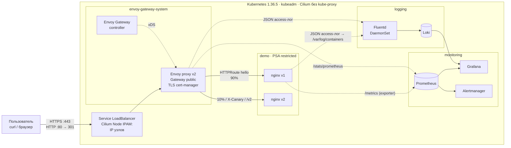

# MTS EngineerHack — Kubernetes, Gateway API, мониторинг и логирование одной командой

[](https://github.com/Captain-Skull/MTS-EngineerHack/actions/workflows/ci.yml)
[](https://github.com/Captain-Skull/MTS-EngineerHack/actions/workflows/image.yml)

Решение кейса DevOps хакатона MTS EngineerHack: с нуля разворачивает кластер Kubernetes через **kubeadm** на Ubuntu 24.04, публикует веб-приложение через **Kubernetes Gateway API**, собирает метрики в **Prometheus** и логи через **Fluentd**. Всё развертывание — `make deploy`; повторный запуск безопасен. Работоспособность на чистой Ubuntu 24.04 проверяется в CI на каждый коммит.

## Содержание

- [Быстрый старт](#быстрый-старт)
- [Архитектура](#архитектура)
- [Технологии и версии](#технологии-и-версии)
- [Требования к среде](#требования-к-среде)
- [Развертывание по шагам](#развертывание-по-шагам)
- [Проверка приложения и Gateway API](#проверка-приложения-и-gateway-api)
- [Проверка мониторинга](#проверка-мониторинга)
- [Проверка логирования](#проверка-логирования)
- [Дополнительные возможности](#дополнительные-возможности)
- [CI/CD](#cicd)
- [Структура репозитория](#структура-репозитория)
- [Известные ограничения](#известные-ограничения)
- [Удаление](#удаление)

## Быстрый старт

На машине с **Ubuntu 24.04** (физической или виртуальной), пользователь с `sudo`:

```bash
git clone https://github.com/Captain-Skull/MTS-EngineerHack.git
cd MTS-EngineerHack
./deploy.sh
```

`./deploy.sh` доустанавливает через apt отсутствующие базовые утилиты (`make`, `git`, `curl`, `python3` — на минимальных образах Ubuntu `make` нет) и запускает `make deploy`. Если `make` уже установлен, можно сразу выполнять `make deploy`. За ~15–20 минут выполняется:

1. `make tools` — скачивает в `./.bin` зафиксированные версии kubectl, helm, helmfile и ansible-core (со сверкой sha256, систему не меняет);
2. `make cluster` — Ansible готовит ОС и создаёт кластер kubeadm на этой машине;
3. `make platform` — helmfile устанавливает сеть, Gateway API, мониторинг, логирование и приложение;
4. `make test` — 23 автоматические проверки: приложение через Gateway API, метрики в Prometheus, логи в Loki.

Если `sudo` требует пароль, Ansible спросит его один раз. Затем:

```bash
make info
```

покажет адрес Gateway, строку для `/etc/hosts`, адреса интерфейсов и готовую команду `curl`. Пароль администратора интерфейсов генерируется при развертывании и сохраняется в `.state/credentials`.

## Архитектура



**Путь запроса.** Запрос на IP узла:443 перехватывает eBPF-программа Cilium (сервис Envoy имеет тип LoadBalancer, адреса — IP узлов) и направляет в под Envoy. Envoy терминирует TLS (wildcard-сертификат `*.demo.test` от cert-manager), по `HTTPRoute` выбирает версию приложения (canary 90/10, заголовок `X-Canary`, путь `/v1` `/v2`) и проксирует в Service. NetworkPolicy разрешает приложению входящий трафик только от Envoy и Prometheus.

**Путь лога.** nginx и Envoy пишут JSON access-логи в stdout → containerd сохраняет их в файлы на узле → Fluentd (по поду на узел) читает файлы, добавляет метаданные Kubernetes, разбирает JSON и отправляет в Loki → просмотр в Grafana. Envoy генерирует `X-Request-Id`, nginx пишет его в свой лог: один запрос находится в логах обоих компонентов.

**Путь метрики.** Prometheus по ServiceMonitor/PodMonitor собирает метрики nginx (sidecar-экспортер), Envoy, Cilium/Hubble, узлов, Kubernetes, control plane, Fluentd, Loki и cert-manager.

**Слои развертывания:**

| Слой | Инструмент | Что делает |
|---|---|---|
| Машины | Multipass (опционально) | VM Ubuntu 24.04 для локального стенда на macOS/Linux |
| ОС и кластер | Ansible + kubeadm | пакеты, ядро, containerd, kubelet, `kubeadm init/join` |
| Платформа | Helmfile (13 Helm-релизов) | Cilium, Envoy Gateway, cert-manager, мониторинг, логирование |
| Приложение и связи | собственные Helm-чарты | `charts/hello`, `charts/platform-config` |
| Точка входа | Make | `make deploy`, `make test`, `make info` |

## Технологии и версии

| Компонент | Версия | Назначение |
|---|---|---|
| **Kubernetes** | **1.36.5** | оркестратор; создаётся **kubeadm** |
| ОС | **Ubuntu 24.04 LTS** | протестировано: Ubuntu 24.04.5 (arm64, Multipass) и GitHub runner `ubuntu-24.04` (amd64) |
| containerd / runc | 2.4.1 / 1.5.2 | container runtime |
| Cilium | 1.20.2 | CNI на eBPF, замена kube-proxy, Node IPAM, NetworkPolicy, Hubble |
| **Envoy Gateway** | **1.9.2** (Envoy 1.39.1) | реализация **Gateway API v1.6.1** |
| cert-manager | 1.21.2 | выпуск и продление TLS-сертификатов |
| kube-prometheus-stack | 91.8.2 | Prometheus 3.15.0, Alertmanager 0.34.1, Grafana 13.2.3, node-exporter 1.12.1, kube-state-metrics 2.20.0 |
| **Fluentd** | **1.19.3** | сбор логов (собственный multi-arch образ с плагином Loki) |
| Loki | 3.7.8 (чарт grafana-community 18.13.7) | хранилище логов |
| nginx (unprivileged) | 1.31.6 | демо-приложение + nginx-prometheus-exporter 1.5.3 |
| metrics-server | 0.9.0 | метрики ресурсов для HPA |
| kubelet-csr-approver | 1.2.15 | одобрение serving-сертификатов kubelet |
| local-path-provisioner | 0.0.37 | PersistentVolume на дисках узлов |
| Ansible (ansible-core) | 2.21.4 | настройка узлов |
| Helm / Helmfile | 4.3.0 / 1.8.1 | установка платформы |

Все версии зафиксированы: CLI — в [`versions.env`](versions.env), компоненты узлов — в [`ansible/group_vars/all.yml`](ansible/group_vars/all.yml), чарты — в [`helmfile/helmfile.yaml.gotmpl`](helmfile/helmfile.yaml.gotmpl), образы приложения — по digest.

> **Почему Kubernetes 1.36, а не 1.37.** Cilium 1.20 и Envoy Gateway 1.9 официально протестированы на Kubernetes 1.33–1.36. Выбрана последняя версия, поддерживаемая всеми компонентами.

### Ресурсы Gateway API

| Ресурс | Имя | Назначение |
|---|---|---|
| `GatewayClass` | `eg` | контроллер Envoy Gateway + параметры прокси (`EnvoyProxy eg-proxy`) |
| `Gateway` | `envoy-gateway-system/public` | слушатели HTTP:80 и HTTPS:443 (`*.demo.test`, TLS terminate), маршруты принимаются только из namespace с меткой `mts-hack/gateway-access=true` |
| `HTTPRoute` | `demo/hello` | `hello.demo.test`: заголовок `X-Canary: always` → v2; `/v1`, `/v2` → конкретная версия (URLRewrite); остальное → 90% v1 / 10% v2 |
| `HTTPRoute` | `envoy-gateway-system/http-to-https` | редирект HTTP → HTTPS (301) |
| `HTTPRoute` | `grafana`, `prometheus`, `alertmanager`, `hubble` | служебные интерфейсы по hostname |
| `ClientTrafficPolicy` | `public-client` | TLS ≥ 1.2, HTTP/2, генерация `X-Request-Id` |
| `BackendTrafficPolicy` | `demo/hello` | rate limit 50 rps, retries, таймауты, circuit breaker, outlier detection |
| `SecurityPolicy` | `*-basic-auth` | basic auth для Prometheus, Alertmanager, Hubble |

## Требования к среде

| | Минимум | Рекомендуется |
|---|---|---|
| ОС | Ubuntu 24.04 LTS (amd64 или arm64) | чистая установка |
| CPU | 4 vCPU | 4+ vCPU |
| RAM | 8 ГБ | 16 ГБ |
| Диск | 30 ГБ свободно | 40 ГБ |
| Сеть | доступ в интернет (пакеты, образы, чарты) | |
| Права | пользователь с `sudo` | |

Порты 80, 443 и 6443 на машине должны быть свободны. Предустановка Docker, kubectl или helm не требуется; если Docker уже установлен, он продолжит работать (kubeadm использует containerd).

## Развертывание по шагам

### Вариант 1. Одна машина Ubuntu 24.04 (основной)

```bash
git clone https://github.com/Captain-Skull/MTS-EngineerHack.git
cd MTS-EngineerHack
sudo apt-get install -y make   # если make отсутствует
make tools      # инструменты в ./.bin
make cluster    # Kubernetes через kubeadm (кластер из одного узла)
make platform   # платформа и приложение
make test       # проверки
make info       # адреса и доступы
```

`make deploy` (или `./deploy.sh`) выполняет `cluster`, `platform` и `test` подряд. Повторный запуск любой команды не меняет работающую систему: Ansible сообщает `changed=0`, helmfile применяет только отличия.

Для работы с кластером напрямую:

```bash
export KUBECONFIG=$PWD/.state/kubeconfig PATH=$PWD/.bin:$PATH
kubectl get nodes
```

(`kubectl` также настроен для пользователя, запустившего `make cluster`, через `~/.kube/config`.)

### Вариант 2. Несколько серверов

Заполните inventory по образцу [`ansible/inventory/example-multinode.ini`](ansible/inventory/example-multinode.ini) (1 control-plane, N worker, доступ по SSH с sudo) и выполните:

```bash
make deploy INVENTORY=ansible/inventory/my-cluster.ini
```

### Вариант 3. Локальный стенд на macOS/Linux (Multipass)

```bash
make lab        # 3 VM Ubuntu 24.04 (1 control-plane + 2 worker) + make deploy
make vms-down   # удалить VM
```

Размер стенда настраивается переменными: `MP_WORKERS=0 make lab` — одна VM.

## Проверка приложения и Gateway API

```bash
make info
```

Пусть `GW` — адрес Gateway из вывода (`kubectl -n envoy-gateway-system get gateway public`). Проверки без правки `/etc/hosts` (`.state/ca.crt` — CA стенда, TLS проверяется полностью):

```bash
curl --cacert .state/ca.crt --resolve hello.demo.test:443:$GW https://hello.demo.test/
# Hello World! version=v1 pod=hello-v1-...

curl -I --resolve hello.demo.test:80:$GW http://hello.demo.test/
# HTTP/1.1 301 Moved Permanently → https://

curl --cacert .state/ca.crt --resolve hello.demo.test:443:$GW -H 'X-Canary: always' https://hello.demo.test/
# version=v2

curl --cacert .state/ca.crt --resolve hello.demo.test:443:$GW https://hello.demo.test/v1
# version=v1

for i in $(seq 100); do curl -s --cacert .state/ca.crt --resolve hello.demo.test:443:$GW https://hello.demo.test/; done | grep -o 'version=v.' | sort | uniq -c
# ~90 v1 / ~10 v2
```

Состояние ресурсов Gateway API:

```bash
kubectl get gatewayclass,gateway,httproute -A
kubectl -n envoy-gateway-system describe gateway public     # Accepted, Programmed, адрес
kubectl -n demo describe httproute hello                    # Accepted, ResolvedRefs
```

После добавления строки из `make info` в `/etc/hosts` приложение доступно в браузере: `https://hello.demo.test` (браузер предупредит о сертификате — он выпущен собственным CA стенда, файл `.state/ca.crt`).

## Проверка мониторинга

**Что собирается:**

| Источник | Метрики |
|---|---|
| nginx (sidecar nginx-prometheus-exporter, ServiceMonitor) | запросы, активные соединения; метка `version` (v1/v2) |
| Envoy Gateway (PodMonitor) | RPS, коды ответа по классам, гистограммы задержек, retries, rate limit |
| node-exporter | CPU, память, диски, сеть узлов |
| kube-state-metrics, kubelet/cAdvisor | состояние объектов, реплики, рестарты, CPU/RAM контейнеров |
| control plane | kube-apiserver, etcd, scheduler, controller-manager, CoreDNS |
| Cilium / Hubble | агент, оператор, сетевые потоки, дропы, DNS |
| Fluentd, Loki, cert-manager | конвейер логов, хранилище, сроки сертификатов |

**Проверка в интерфейсе.** `https://prometheus.demo.test` (логин `admin`, пароль из `.state/credentials`) → *Status → Target health*: все цели в состоянии UP. Примеры запросов:

```promql
up{namespace="demo"}
sum by (version) (rate(nginx_http_requests_total[5m]))
sum by (envoy_response_code_class) (rate(envoy_cluster_upstream_rq_xx{envoy_cluster_name=~"httproute/demo/hello/.*"}[5m]))
histogram_quantile(0.99, sum by (le) (rate(envoy_cluster_upstream_rq_time_bucket{envoy_cluster_name=~"httproute/demo/hello/.*"}[5m])))
```

**Проверка из командной строки** (через API server, без port-forward):

```bash
kubectl get --raw '/api/v1/namespaces/monitoring/services/kube-prometheus-stack-prometheus:9090/proxy/api/v1/query?query=nginx_http_requests_total'
```

**Grafana** — `https://grafana.demo.test` → *Dashboards → MTS Hack → «Hello service — SLO, RED, canary, логи»*: SLO и остаток бюджета ошибок, burn rate, RPS, доля 5xx, перцентили задержки, распределение трафика v1/v2, коды ответов по версиям из логов, ресурсы, HPA, состояние конвейера логов, лента access-логов. Также доступны стандартные дашборды kube-prometheus-stack (узлы, поды, API server, etcd).

**SLO и бюджет ошибок** (`charts/platform-config/templates/slo.yaml`, цели — в `charts/platform-config/values.yaml`, окно 7 дней по сроку хранения Prometheus):

| SLO | SLI | Цель |
|---|---|---|
| Доступность | доля ответов backend-а hello без 5xx (метрики Envoy) | 99.9% |
| Задержка | доля запросов, обслуженных быстрее 250 мс (гистограмма Envoy) | 99% |

Алерты по **burn rate** (скорости расходования бюджета ошибок) по методике Google SRE с парами окон: `HelloAvailabilityBudgetBurnFast` / `HelloLatencyBudgetBurnFast` — critical, 14.4× за 1 ч и 5 мин или 6× за 6 ч и 30 мин; `...BudgetBurnSlow` — warning, 3× за 1 день и 2 ч или 1× за 3 дня и 6 ч. Короткое окно гасит алерт сразу после устранения проблемы. Проверка: в течение нескольких минут отправлять часть запросов на `https://hello.demo.test/error` → в Prometheus *Alerts* алерт `HelloAvailabilityBudgetBurnFast` переходит в `firing`; на дашборде растёт burn rate и падает остаток бюджета.

**Остальные алерты** (`charts/platform-config/templates/alerts.yaml`): нет готовых реплик, target приложения недоступен, недоступен Gateway, срабатывает rate limit, Fluentd не отправляет логи, получает ошибки или копит буфер, Loki недоступен, сертификат истекает или не выпущен.

## Проверка логирования

**Что собирается:** stdout/stderr всех контейнеров кластера (access-логи nginx и Envoy в JSON, error-лог nginx), а также аудит-журнал API server. **Куда:** Fluentd (DaemonSet, по экземпляру на узел) → Loki (namespace `logging`) → Grafana. Метки потоков: `namespace`, `container`, `app`, `node`, `stream`, `cluster`; поля JSON (status, uri, request_id, app_version, pod …) доступны парсером LogQL.

**Сценарий проверки:** отправить запрос с уникальным идентификатором и найти его в логах.

```bash
curl --cacert .state/ca.crt --resolve hello.demo.test:443:$GW -H 'X-Request-Id: check-001' https://hello.demo.test/
```

В Grafana → *Explore* → источник *Loki*:

```logql
{namespace=~"demo|envoy-gateway-system"} |= "check-001"
```

Появятся две записи: от Envoy (маршрут, upstream-под, длительность) и от nginx (версия, под, статус). Другие запросы:

```logql
{namespace="demo", container="nginx"} | json | status >= 400
sum by (app_version, status) (count_over_time({namespace="demo", container="nginx"} | json [5m]))
{container="kube-apiserver-audit"} | json | verb="delete"
```

Из командной строки:

```bash
kubectl get --raw '/api/v1/namespaces/logging/services/loki:3100/proxy/loki/api/v1/query_range?query=%7Bnamespace%3D%22demo%22%7D%20%7C%3D%20%22check-001%22'
```

Этот же сценарий автоматически выполняет `make test`.

## Дополнительные возможности

**Gateway API:** HTTP→HTTPS, TLS с автоматическим выпуском и продлением (cert-manager, собственный CA), маршрутизация по hostname, пути и заголовку, URL rewrite, несколько backend, canary 90/10 (вес — `canaryWeight` в values), rate limit, retries с backoff, таймауты, circuit breaker, пассивные health checks, basic auth для служебных интерфейсов, сквозной `X-Request-Id`.

**Мониторинг и логирование:** RED-метрики через Envoy, метрики по версиям, метрики из логов (LogQL), SLO доступности и задержки с алертами по burn rate бюджета ошибок (методика Google SRE), собственный дашборд Grafana как код, 14 алертов и 24 recording rules, метрики control plane и etcd, сетевая наблюдаемость Hubble, аудит API server в Loki, мониторинг самого конвейера логов.

**Надёжность:** 2+ реплики приложения и Envoy, HPA (2–6 реплик по CPU), PodDisruptionBudget, rolling update без простоя (`maxUnavailable: 0`, readiness, `preStop`), распределение реплик по узлам, файловый буфер Fluentd с повторами.

**Безопасность:** Pod Security Admission `restricted` для приложения (non-root, read-only FS, без capabilities, seccomp), NetworkPolicy, шифрование Secret в etcd (ключ генерируется на узле), аудит API server, настоящие serving-сертификаты kubelet (без `insecure-skip-verify`), TLS ≥ 1.2, отсутствие секретов в Git (пароли генерируются при развертывании), образы по digest, проверка sha256 всех загружаемых бинарников.

**Автоматизация:** одна команда, идемпотентность (подтверждается в CI), зафиксированные версии всех зависимостей, инструменты устанавливаются в каталог проекта без изменения системы, три режима развертывания (одна машина, несколько серверов, Multipass).

## CI/CD

GitHub Actions ([`.github/workflows`](.github/workflows)):

- **ci.yml → lint:** gitleaks (секреты в истории), shellcheck, yamllint, ansible-lint (профиль production), hadolint, `helm lint`, рендеринг всей платформы и валидация 300+ манифестов по схемам Kubernetes 1.36 и CRD (kubeconform), Trivy misconfiguration.
- **ci.yml → e2e:** на чистом runner `ubuntu-24.04` выполняется `make cluster` и `make platform` (настоящий kubeadm-кластер), затем проверка идемпотентности (повторный Ansible — `changed=0`, `helmfile diff` пуст) и `make test`. При ошибке сохраняется диагностика.
- **image.yml:** сборка образа Fluentd для linux/amd64 и linux/arm64, публикация в GHCR (`ghcr.io/captain-skull/fluentd-k8s-loki`), SBOM и provenance, сканирование Trivy, keyless-подпись cosign. На pull request образ только собирается.

- **Renovate** ([`renovate.json`](renovate.json)): еженедельно проверяет все зафиксированные версии — Helm-чарты, образы (тег и digest вместе), GitHub Actions, гемы Fluentd, коллекции Ansible, а также версии в `versions.env`, `group_vars` и CI — и создаёт pull request с обновлением, который проверяет CI (включая e2e). Kubernetes обновляется только в пределах патч-версий: минорное обновление требует проверки совместимости и `kubeadm upgrade`. Сводка — issue «Dependency Dashboard».

Проверка подписи образа (cosign v3+; подпись хранится в формате OCI referrers):

```bash
cosign verify ghcr.io/captain-skull/fluentd-k8s-loki:1.19.3-1 \
  --certificate-identity-regexp 'https://github.com/Captain-Skull/MTS-EngineerHack/.*' \
  --certificate-oidc-issuer https://token.actions.githubusercontent.com
```

## Структура репозитория

```
deploy.sh                   развертывание одной командой (доустанавливает make)
Makefile                    точка входа (make help — список команд)
versions.env                версии CLI-инструментов
renovate.json               правила автоматического обновления зависимостей
scripts/                    install-tools, multipass, platform, smoke-test, info
ansible/                    роли common, containerd, kubernetes, control_plane, worker
helmfile/                   описание платформы, values сторонних чартов, namespaces
charts/hello/               демо-приложение
charts/platform-config/     Gateway API, TLS, политики, мониторы, алерты, дашборд
images/fluentd/             Dockerfile и Gemfile образа Fluentd
.github/workflows/          CI/CD
```

## Известные ограничения

- **Один control-plane узел.** Нет отказоустойчивости API server и etcd; для production нужны 3 узла control plane и балансировщик перед API.
- **Хранилище local-path.** Тома Prometheus и Loki привязаны к диску конкретного узла и не переживают его потерю; в production — сетевое или объектное хранилище (Ceph, S3).
- **Loki в монолитном режиме**, одна реплика, хранение 72 часа; Prometheus — одна реплика, 7 дней.
- **Собственный CA.** Сертификаты не доверены браузерами; для публичного домена ClusterIssuer заменяется на ACME (Let's Encrypt) без изменения Gateway.
- **Node IPAM вместо выделенного балансировщика.** Gateway доступен по IP узлов; в production — BGP/L2-анонс выделенного адреса (Cilium LB-IPAM).
- **Демо-домен `demo.test`** требует записи в `/etc/hosts` или `curl --resolve`.
- **Rate limit локальный** — предел на каждую реплику Envoy, а не общий на кластер.
- **Привилегированные namespace** `monitoring`, `logging`, `local-path-storage`: node-exporter, Fluentd и local-path требуют доступа к узлу.
- Для установки нужен доступ в интернет (пакеты Ubuntu, pkgs.k8s.io, GitHub, реестры образов и чартов).

## Удаление

```bash
make reset      # kubeadm reset на узлах (пакеты остаются), удаляет локальный kubeconfig
make vms-down   # для стенда Multipass — удалить VM
```
