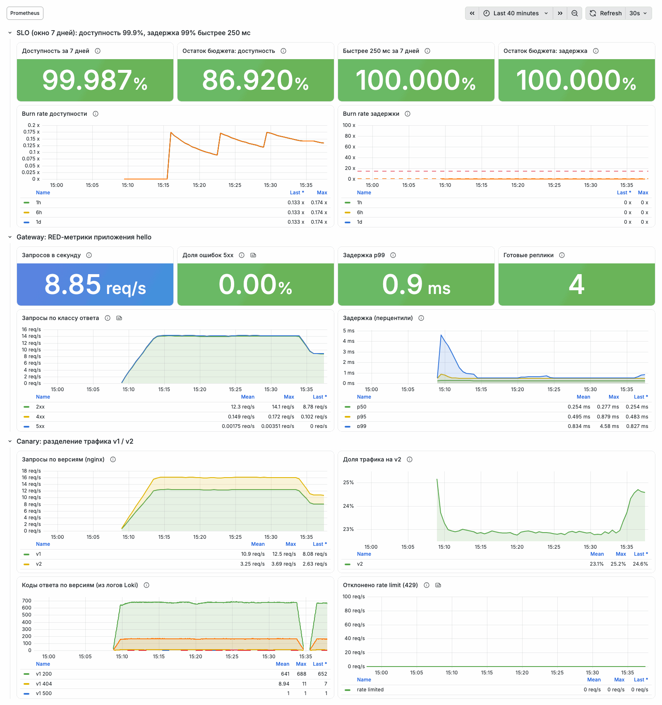
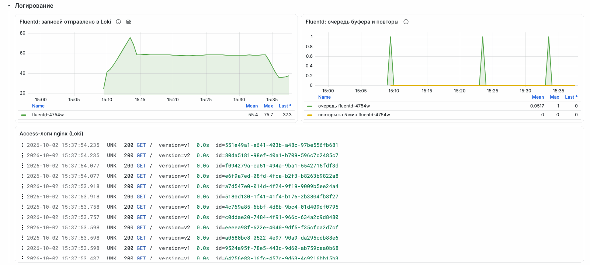
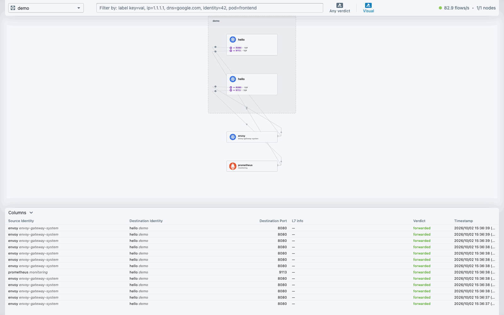
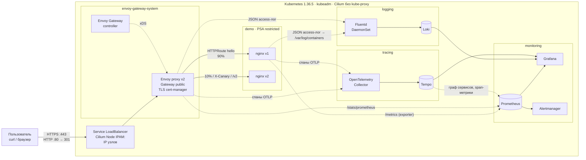

# MTS EngineerHack: Kubernetes, Gateway API, мониторинг и логирование одной командой

[](https://github.com/Captain-Skull/MTS-EngineerHack/actions/workflows/ci.yml)
[](https://github.com/Captain-Skull/MTS-EngineerHack/actions/workflows/image.yml)

Решение кейса DevOps хакатона MTS EngineerHack. Проект с нуля поднимает кластер Kubernetes через kubeadm на Ubuntu 24.04, публикует веб-приложение через Kubernetes Gateway API, собирает метрики в Prometheus и логи через Fluentd. Развертывание запускается одной командой `make deploy`, и её можно безопасно повторять. На каждый коммит CI проверяет всё это на чистой Ubuntu 24.04.

## Содержание

- [Быстрый старт](#быстрый-старт)
- [Соответствие требованиям кейса](#соответствие-требованиям-кейса)
- [Как это выглядит](#как-это-выглядит)
- [Архитектура](#архитектура)
- [Технологии и версии](#технологии-и-версии)
- [Требования к среде](#требования-к-среде)
- [Развертывание по шагам](#развертывание-по-шагам)
- [Проверка приложения и Gateway API](#проверка-приложения-и-gateway-api)
- [Проверка мониторинга](#проверка-мониторинга)
- [Проверка логирования](#проверка-логирования)
- [Проверка трейсинга](#проверка-трейсинга)
- [Резервное копирование etcd](#резервное-копирование-etcd)
- [Политики допуска и подпись образов](#политики-допуска-и-подпись-образов)
- [GitOps и progressive delivery (Argo CD + Flagger)](#gitops-и-progressive-delivery-argo-cd--flagger)
- [Нагрузочный тест и автомасштабирование](#нагрузочный-тест-и-автомасштабирование)
- [Соответствие CIS Kubernetes Benchmark](#соответствие-cis-kubernetes-benchmark)
- [Тест отказоустойчивости](#тест-отказоустойчивости)
- [Дополнительные возможности](#дополнительные-возможности)
- [CI/CD](#cicd)
- [Структура репозитория](#структура-репозитория)
- [Известные ограничения](#известные-ограничения)
- [Удаление](#удаление)

## Быстрый старт

Нужна машина с Ubuntu 24.04 (физическая или виртуальная) и пользователь с `sudo`:

```bash
git clone https://github.com/Captain-Skull/MTS-EngineerHack.git
cd MTS-EngineerHack
./deploy.sh
```

`./deploy.sh` ставит через apt недостающие утилиты (`make`, `git`, `curl`, `python3`; на минимальных образах Ubuntu нет даже `make`) и запускает `make deploy`. Если `make` уже есть, можно сразу запускать `make deploy`. На чистой VM Ubuntu 24.04 с 4 vCPU и 8 ГБ RAM развертывание заняло около 12 минут, память в пике дошла до 5,5 ГБ. Повторный запуск идёт около минуты и ничего не меняет: Ansible пишет `changed=0`, helmfile не находит отличий. По шагам:

1. `make tools` скачивает в `./.bin` закреплённые версии kubectl, helm, helmfile и ansible-core, сверяет sha256 и ничего не ставит в систему;
2. `make cluster`: Ansible готовит ОС и создаёт на этой машине кластер kubeadm;
3. `make platform`: helmfile ставит сеть, Gateway API, мониторинг, логирование и приложение;
4. `make test` прогоняет 37 автоматических проверок. Среди них приложение через Gateway API, Argo CD и Flagger, метрики в Prometheus, логи в Loki, трейсы в Tempo, бэкап etcd и политики Kyverno.

Если `sudo` требует пароль, Ansible спросит его один раз. Затем:

```bash
make info
```

выведет адрес Gateway, строку для `/etc/hosts`, адреса интерфейсов и готовую команду `curl`. Пароль администратора создаётся при развертывании и лежит в `.state/credentials`.

## Соответствие требованиям кейса

Все обязательные пункты проверяет `make test`. В таблице указано, где сделан каждый пункт и как проверить его руками. `GW` в командах означает адрес из `make info`.

| Требование | Как реализовано | Как проверить |
|---|---|---|
| Kubernetes, приоритет kubeadm | kubeadm 1.36.5, containerd 2.4.1, Ansible ([`ansible/`](ansible)) | `kubectl get nodes -o wide` |
| Ubuntu 24.04 | проверено на Ubuntu 24.04.5 (VM 4 vCPU / 8 ГБ, Multipass) и в CI на runner `ubuntu-24.04` на каждом коммите | [CI](https://github.com/Captain-Skull/MTS-EngineerHack/actions) |
| Простое веб-приложение с однозначным ответом и access-логами | nginx (unprivileged), ответ `Hello World!`, JSON access-лог в stdout ([`charts/hello`](charts/hello)) | `curl --cacert .state/ca.crt --resolve hello.demo.test:443:$GW https://hello.demo.test/` → `Hello World! version=v1 …` |
| Gateway API: контроллер, GatewayClass, Gateway, HTTPRoute | Envoy Gateway 1.9.2 (Gateway API v1.6.1), `GatewayClass eg`, `Gateway public`, `HTTPRoute hello` → Service приложения ([`charts/platform-config`](charts/platform-config)) | `kubectl get gatewayclass,gateway,httproute -A`; [раздел проверки](#проверка-приложения-и-gateway-api) |
| Prometheus собирает метрики | kube-prometheus-stack; метрики nginx, Envoy, узлов, control plane, Cilium, Fluentd, Loki и др. | `kubectl get --raw '/api/v1/namespaces/monitoring/services/kube-prometheus-stack-prometheus:9090/proxy/api/v1/query?query=nginx_http_requests_total'`; [раздел проверки](#проверка-мониторинга) |
| Fluentd/Filebeat собирает логи приложения | Fluentd (DaemonSet) → Loki → Grafana; access- и error-логи nginx и Envoy | запрос с `X-Request-Id: check-001` и поиск в Loki, см. [раздел проверки](#проверка-логирования) |
| Автоматизация, минимум команд, без ручного создания ресурсов | `./deploy.sh` (одна команда) = `make tools cluster platform test` | [Быстрый старт](#быстрый-старт) |
| Повторный запуск не ломает систему | Ansible идемпотентен (`changed=0`), helmfile применяет только разницу | повторный `make deploy`; в CI отдельный шаг проверяет `changed=0` и пустой `helmfile diff` |
| Без коммерческих сервисов и доступа к инфраструктуре участника | только open-source компоненты, образы из публичных реестров, собственный образ Fluentd собирается из [`images/fluentd`](images/fluentd) | |
| Нет чувствительных данных в репозитории | пароли генерируются при развертывании в `.state/` (в `.gitignore`) | gitleaks проверяет всю историю в CI на каждом коммите |
| README: версия Kubernetes, способ создания кластера, ОС, реализация Gateway API и её ресурсы | этот документ | [Технологии и версии](#технологии-и-версии), [Ресурсы Gateway API](#ресурсы-gateway-api) |

Сверх обязательного (подробности ниже): TLS и HTTP→HTTPS, canary 90/10, маршрутизация по hostname, пути и заголовку, rate limit, retries; SLO с алертами по burn rate, дашборд Grafana, трейсинг OpenTelemetry → Tempo; CI/CD с e2e на настоящем kubeadm-кластере; GitOps (Argo CD) и автоматический canary с откатом (Flagger); проверка подписи образов (Kyverno); CIS Benchmark; бэкапы etcd с проверяемым восстановлением; тесты отказоустойчивости и нагрузки; [архитектурные решения (ADR)](docs/adr/README.md).

## Как это выглядит

Скриншоты сняты с работающего стенда (одна машина Ubuntu 24.04 после `./deploy.sh`) под фоновой нагрузкой.

Дашборд Grafana «Hello service»: SLO и бюджет ошибок, RED-метрики через Gateway, canary v1/v2.



Конвейер логов Fluentd → Loki и живая лента access-логов nginx с request_id.



Hubble показывает сетевые потоки namespace `demo`. К приложению ходят только Envoy (порт 8080) и Prometheus (9113), как и разрешает NetworkPolicy.



<details>
<summary><b>Вывод <code>make test</code> на чистой VM Ubuntu 24.04 (4 vCPU, 8 ГБ)</b></summary>

```text
0. Кластер
  ✔ API server доступен
  ✔ все узлы Ready (1/1)

1. Gateway API
  ✔ Gateway envoy-gateway-system/public Programmed
  ✔ HTTPRoute demo/hello Accepted
     адрес Gateway: 192.168.252.9
  ✔ HTTP → 301 редирект на HTTPS (получено 301)
  ✔ HTTPS (TLS проверен по CA стенда) → «Hello World!»: Hello World! version=v1 pod=hello-v1-fdd548cb6-t5fs6
  ✔ X-Canary: always → версия v2
  ✔ /v1 → версия v1 (URLRewrite)
  ✔ /v2 → версия v2 (URLRewrite)
  ✔ canary: 5/40 запросов на v2 (ожидается ~10%)
  ✔ Prometheus UI без пароля → 401 (получено 401)
  ✔ Prometheus UI с basic auth → 200 (получено 200)
  ✔ Grafana через Gateway /api/health
  ✔ Flagger: Canary demo/rollout инициализирован (HTTPRoute создан Flagger)
  ✔ rollout.demo.test через Gateway → podinfo
  ✔ Argo CD: приложение rollout синхронизировано из Git (main)
  ✔ Argo CD self-heal: удалённая вручную NetworkPolicy восстановлена из Git

2. Логирование (nginx → Fluentd → Loki)
     отправлен запрос с X-Request-Id: smoke-1791029780-10520
  ✔ access-лог запроса (nginx) найден в Loki: {namespace="demo", container="nginx"} |= "smoke-1791029780-10520"
     {"time":"2026-10-03T15:16:20.171181659+03:00","kubernetes":{"pod_name":"hello-v1-fdd548cb6-cpvn7","pod_id":"bfd46dd0-7b02-404e-8acd-5777e05d88e8","pod_ip":"10.244.0.51","labels":{"app.kubernetes.io/in…
  ✔ тот же запрос в access-логе Envoy Gateway (сквозной request_id)

2.5 Трейсинг (Envoy, nginx → OpenTelemetry Collector → Tempo)
     отправлен запрос с traceparent, trace_id: 2d02ad96c7b531b7c305e82152bb3d67
  ✔ трейс запроса найден в Tempo и содержит спаны Envoy и nginx
     сервисы в трейсе: hello-v1 public.envoy-gateway-system

3. Мониторинг (Prometheus)
  ✔ PromQL up{job=~"hello-v.*"} → 4 рядов
  ✔ PromQL nginx_http_requests_total → 4 рядов
  ✔ PromQL envoy_cluster_upstream_rq_total → 14 рядов
  ✔ PromQL fluentd_output_status_emit_records → 4 рядов
  ✔ PromQL node_cpu_seconds_total → 32 рядов
  ✔ PromQL kube_pod_status_ready → 138 рядов
  ✔ PromQL hubble_flows_processed_total → 12 рядов
  ✔ PromQL traces_spanmetrics_calls_total → 10 рядов
  ✔ все targets Prometheus в состоянии up
  ✔ правила Prometheus (включая SLO) загружены и вычисляются без ошибок
     текущий RPS приложения: 0.5404958333333334

4. Резервное копирование etcd
  ✔ снапшот etcd снят и проверен: snapshot saved: /backups/etcd-snapshot-20261003T121659Z.db (57290784 bytes)

5. Политики допуска (Kyverno)
  ✔ ImageValidatingPolicy verify-image-signatures готова
  ✔ ValidatingPolicy require-image-digest готова
  ✔ подписанный CI образ допущен и закреплён по digest: ghcr.io/captain-skull/fluentd-k8s-loki:1.19.3-1@sha256:79a73330c885617b638f593ddad79b0c64c02457cc534c344cff17125acb934c
  ✔ образ без подписи из ghcr.io/captain-skull отклонён
  ✔ тот же образ отклонён, если доверять другому подписанту (подпись реально проверяется)
  ✔ под без digest в namespace demo отклонён политикой require-image-digest

Итог: 37 пройдено, 0 провалено
```

</details>

## Архитектура



Путь запроса. Запрос на IP узла, порт 443, перехватывает eBPF-программа Cilium (у сервиса Envoy тип LoadBalancer, его адреса совпадают с IP узлов) и отправляет в под Envoy. Envoy терминирует TLS (wildcard-сертификат `*.demo.test` от cert-manager), по `HTTPRoute` выбирает версию приложения (canary 90/10, заголовок `X-Canary`, путь `/v1` `/v2`) и проксирует в Service. NetworkPolicy разрешает приложению входящий трафик только от Envoy и Prometheus.

Путь лога. nginx и Envoy пишут JSON access-логи в stdout, containerd складывает их в файлы на узле. Fluentd (по одному поду на узел) читает эти файлы, добавляет метаданные Kubernetes, разбирает JSON и отправляет записи в Loki, а смотреть их удобно в Grafana. Envoy генерирует `X-Request-Id`, nginx пишет его в свой лог: один запрос находится в логах обоих компонентов.

Путь трейса. Envoy начинает (или продолжает, если клиент прислал W3C `traceparent`) трейс и передаёт контекст в nginx; оба отправляют спаны по OTLP в OpenTelemetry Collector, который добавляет атрибуты Kubernetes и пересылает их в Tempo. Tempo строит из трейсов граф сервисов и метрики спанов и записывает их в Prometheus. `trace_id` есть в access-логах Envoy и nginx: в Grafana можно перейти от строки лога к трейсу и обратно.

Путь метрики. Prometheus по ServiceMonitor/PodMonitor собирает метрики nginx (sidecar-экспортер), Envoy, Cilium/Hubble, узлов, Kubernetes, control plane, Fluentd, Loki и cert-manager.

Слои развертывания:

| Слой | Инструмент | Что делает |
|---|---|---|
| Машины | Multipass (опционально) | VM Ubuntu 24.04 для локального стенда на macOS/Linux |
| ОС и кластер | Ansible + kubeadm | пакеты, ядро, containerd, kubelet, `kubeadm init/join` |
| Платформа | Helmfile (21 Helm-релиз) | Cilium, Envoy Gateway, cert-manager, мониторинг, логирование, трейсинг, бэкапы etcd, Kyverno, Flagger, Argo CD |
| Приложение и связи | собственные Helm-чарты | `charts/hello`, `charts/platform-config` |
| Доставка приложений из Git | Argo CD (GitOps) | `charts/rollout` синхронизируется из репозитория, выкатку выполняет Flagger |
| Точка входа | Make | `make deploy`, `make test`, `make info` |

Почему выбраны именно эти компоненты, что ещё рассматривалось и чем пришлось заплатить за выбор, описано в [архитектурных решениях (ADR)](docs/adr/README.md).

## Технологии и версии

| Компонент | Версия | Назначение |
|---|---|---|
| Kubernetes | 1.36.5 | оркестратор, кластер создаёт kubeadm |
| ОС | Ubuntu 24.04 LTS | протестировано: Ubuntu 24.04.5 (arm64, Multipass) и GitHub runner `ubuntu-24.04` (amd64) |
| containerd / runc | 2.4.1 / 1.5.2 | container runtime |
| Cilium | 1.20.2 | CNI на eBPF, замена kube-proxy, Node IPAM, NetworkPolicy, Hubble |
| Envoy Gateway | 1.9.2 (Envoy 1.39.1) | реализация Gateway API v1.6.1 |
| cert-manager | 1.21.2 | выпуск и продление TLS-сертификатов |
| kube-prometheus-stack | 91.8.2 | Prometheus 3.15.0, Alertmanager 0.34.1, Grafana 13.2.3, node-exporter 1.12.1, kube-state-metrics 2.20.0 |
| Fluentd | 1.19.3 | сбор логов (собственный multi-arch образ с плагином Loki) |
| Loki | 3.7.8 (чарт grafana-community 18.13.7) | хранилище логов |
| Tempo | 3.1.0 | хранилище трейсов, metrics-generator (граф сервисов, span-метрики) |
| OpenTelemetry Collector | 0.161.0 (чарт 0.175.0) | приём спанов OTLP, атрибуты Kubernetes, отправка в Tempo |
| nginx (unprivileged, `-otel`) | 1.31.6 | демо-приложение с модулем OpenTelemetry + nginx-prometheus-exporter 1.5.3 |
| Argo CD | 3.5.3 (чарт 10.9.6) | GitOps: приложение `rollout` синхронизируется из Git, автоматическое исправление ручных изменений |
| Flagger | 1.45.0 | progressive delivery: canary через Gateway API с анализом метрик Prometheus и автоматическим откатом |
| podinfo | 6.15.0 | демо-приложение для progressive delivery |
| Kyverno | 1.19.1 (чарт 3.9.1) | политики допуска: проверка подписи образов cosign, образы только по digest |
| metrics-server | 0.9.0 | метрики ресурсов для HPA |
| kubelet-csr-approver | 1.2.15 | одобрение serving-сертификатов kubelet |
| local-path-provisioner | 0.0.37 | PersistentVolume на дисках узлов |
| Ansible (ansible-core) | 2.21.4 | настройка узлов |
| Helm / Helmfile | 4.3.0 / 1.8.1 | установка платформы |

Все версии закреплены. CLI перечислены в [`versions.env`](versions.env), компоненты узлов в [`ansible/group_vars/all.yml`](ansible/group_vars/all.yml), чарты в [`helmfile/helmfile.yaml.gotmpl`](helmfile/helmfile.yaml.gotmpl), а образы приложения указаны по digest.

> Почему Kubernetes 1.36, а не 1.37? Cilium 1.20 и Envoy Gateway 1.9 официально тестируются на Kubernetes с 1.33 по 1.36. Я взял самую новую версию, которую поддерживают оба.

### Ресурсы Gateway API

| Ресурс | Имя | Назначение |
|---|---|---|
| `GatewayClass` | `eg` | контроллер Envoy Gateway + параметры прокси (`EnvoyProxy eg-proxy`) |
| `Gateway` | `envoy-gateway-system/public` | слушатели HTTP:80 и HTTPS:443 (`*.demo.test`, TLS terminate), маршруты принимаются только из namespace с меткой `mts-hack/gateway-access=true` |
| `HTTPRoute` | `demo/hello` | `hello.demo.test`: заголовок `X-Canary: always` → v2; `/v1`, `/v2` → конкретная версия (URLRewrite); остальное → 90% v1 / 10% v2 |
| `HTTPRoute` | `demo/rollout` | `rollout.demo.test`. Этот маршрут создаёт и ведёт сам Flagger, веса стабильной версии и canary меняются по шагам анализа |
| `HTTPRoute` | `envoy-gateway-system/http-to-https` | редирект HTTP → HTTPS (301) |
| `HTTPRoute` | `grafana`, `prometheus`, `alertmanager`, `hubble`, `argocd` | служебные интерфейсы по hostname |
| `ClientTrafficPolicy` | `public-client` | TLS ≥ 1.2, HTTP/2, генерация `X-Request-Id` |
| `BackendTrafficPolicy` | `demo/hello` | rate limit 100 rps на реплику Envoy, retries, таймауты, circuit breaker, outlier detection |
| `SecurityPolicy` | `*-basic-auth` | basic auth для Prometheus, Alertmanager, Hubble |

## Требования к среде

| | Минимум | Рекомендуется |
|---|---|---|
| ОС | Ubuntu 24.04 LTS (amd64 или arm64) | чистая установка |
| CPU | 4 vCPU | 4+ vCPU |
| RAM | 8 ГБ (проверено: пик 5,5 ГБ) | 16 ГБ |
| Диск | 30 ГБ свободно | 40 ГБ |
| Сеть | доступ в интернет (пакеты, образы, чарты) | |
| Права | пользователь с `sudo` | |

Порты 80, 443 и 6443 на машине должны быть свободны. Предустановка Docker, kubectl или helm не требуется; если Docker уже установлен, он продолжит работать (kubeadm использует containerd).

## Развертывание по шагам

### Вариант 1. Одна машина Ubuntu 24.04 (основной)

```bash
git clone https://github.com/Captain-Skull/MTS-EngineerHack.git
cd MTS-EngineerHack
sudo apt-get install -y make   # если make отсутствует
make tools      # инструменты в ./.bin
make cluster    # Kubernetes через kubeadm (кластер из одного узла)
make platform   # платформа и приложение
make test       # проверки
make info       # адреса и доступы
```

`make deploy` (или `./deploy.sh`) выполняет `cluster`, `platform` и `test` подряд. Повторный запуск любой команды не меняет работающую систему: Ansible сообщает `changed=0`, helmfile применяет только отличия.

Для работы с кластером напрямую:

```bash
export KUBECONFIG=$PWD/.state/kubeconfig PATH=$PWD/.bin:$PATH
kubectl get nodes
```

(`kubectl` также настроен для пользователя, запустившего `make cluster`, через `~/.kube/config`.)

### Вариант 2. Несколько серверов

Заполните inventory по образцу [`ansible/inventory/example-multinode.ini`](ansible/inventory/example-multinode.ini) (1 control-plane, N worker, доступ по SSH с sudo) и выполните:

```bash
make deploy INVENTORY=ansible/inventory/my-cluster.ini
```

### Вариант 3. Локальный стенд на macOS/Linux (Multipass)

```bash
make lab        # 3 VM Ubuntu 24.04 (1 control-plane + 2 worker) + make deploy
make vms-down   # удалить VM
```

Размер стенда задаётся переменными, например `MP_WORKERS=0 make lab` создаст одну VM.

## Проверка приложения и Gateway API

```bash
make info
```

Дальше `GW` означает адрес Gateway из этого вывода (его же покажет `kubectl -n envoy-gateway-system get gateway public`). Команды работают без правки `/etc/hosts`. Файл `.state/ca.crt` содержит CA стенда, поэтому TLS проверяется полностью:

```bash
curl --cacert .state/ca.crt --resolve hello.demo.test:443:$GW https://hello.demo.test/
# Hello World! version=v1 pod=hello-v1-...

curl -I --resolve hello.demo.test:80:$GW http://hello.demo.test/
# HTTP/1.1 301 Moved Permanently → https://

curl --cacert .state/ca.crt --resolve hello.demo.test:443:$GW -H 'X-Canary: always' https://hello.demo.test/
# version=v2

curl --cacert .state/ca.crt --resolve hello.demo.test:443:$GW https://hello.demo.test/v1
# version=v1

for i in $(seq 100); do curl -s --cacert .state/ca.crt --resolve hello.demo.test:443:$GW https://hello.demo.test/; done | grep -o 'version=v.' | sort | uniq -c
# ~90 v1 / ~10 v2
```

Состояние ресурсов Gateway API:

```bash
kubectl get gatewayclass,gateway,httproute -A
kubectl -n envoy-gateway-system describe gateway public     # Accepted, Programmed, адрес
kubectl -n demo describe httproute hello                    # Accepted, ResolvedRefs
```

После добавления строки из `make info` в `/etc/hosts` приложение доступно в браузере: `https://hello.demo.test` (браузер предупредит о сертификате, потому что его выпустил собственный CA стенда из файла `.state/ca.crt`).

## Проверка мониторинга

Что собирается:

| Источник | Метрики |
|---|---|
| nginx (sidecar nginx-prometheus-exporter, ServiceMonitor) | запросы, активные соединения; метка `version` (v1/v2) |
| Envoy Gateway (PodMonitor) | RPS, коды ответа по классам, гистограммы задержек, retries, rate limit |
| node-exporter | CPU, память, диски, сеть узлов |
| kube-state-metrics, kubelet/cAdvisor | состояние объектов, реплики, рестарты, CPU/RAM контейнеров |
| control plane | kube-apiserver, etcd, scheduler, controller-manager, CoreDNS |
| Cilium / Hubble | агент, оператор, сетевые потоки, дропы, DNS |
| Fluentd, Loki, cert-manager | конвейер логов, хранилище, сроки сертификатов |

Проверка в интерфейсе: откройте `https://prometheus.demo.test` (логин `admin`, пароль из `.state/credentials`) и раздел *Status → Target health*, все цели должны быть в состоянии UP. Несколько запросов для примера:

```promql
up{namespace="demo"}
sum by (version) (rate(nginx_http_requests_total[5m]))
sum by (envoy_response_code_class) (rate(envoy_cluster_upstream_rq_xx{envoy_cluster_name=~"httproute/demo/hello/.*"}[5m]))
histogram_quantile(0.99, sum by (le) (rate(envoy_cluster_upstream_rq_time_bucket{envoy_cluster_name=~"httproute/demo/hello/.*"}[5m])))
```

То же из командной строки, через API server и без port-forward:

```bash
kubectl get --raw '/api/v1/namespaces/monitoring/services/kube-prometheus-stack-prometheus:9090/proxy/api/v1/query?query=nginx_http_requests_total'
```

В Grafana (`https://grafana.demo.test`) откройте *Dashboards → MTS Hack → «Hello service — SLO, RED, canary, логи»*. Там SLO и остаток бюджета ошибок, burn rate, RPS, доля 5xx, перцентили задержки, распределение трафика v1/v2, коды ответов по версиям из логов, ресурсы, HPA, состояние конвейера логов, лента access-логов. Стандартные дашборды kube-prometheus-stack (узлы, поды, API server, etcd) тоже на месте.

SLO и бюджет ошибок описаны в `charts/platform-config/templates/slo.yaml`, цели заданы в `charts/platform-config/values.yaml`. Окно 7 дней, по сроку хранения Prometheus.

| SLO | SLI | Цель |
|---|---|---|
| Доступность | доля ответов backend-а hello без 5xx (метрики Envoy) | 99.9% |
| Задержка | доля запросов, обслуженных быстрее 250 мс (гистограмма Envoy) | 99% |

Алерты считают burn rate, то есть скорость расходования бюджета ошибок, по методике Google SRE с парами окон. `HelloAvailabilityBudgetBurnFast` и `HelloLatencyBudgetBurnFast` имеют уровень critical и срабатывают при 14.4× за 1 ч и 5 мин или при 6× за 6 ч и 30 мин. `...BudgetBurnSlow` имеют уровень warning: 3× за 1 день и 2 ч или 1× за 3 дня и 6 ч. Короткое окно гасит алерт почти сразу после того, как проблему устранили. Проверить просто: несколько минут слать часть запросов на `https://hello.demo.test/error`. В Prometheus на странице *Alerts* `HelloAvailabilityBudgetBurnFast` перейдёт в `firing`, а на дашборде вырастет burn rate и уменьшится остаток бюджета.

Остальные алерты лежат в `charts/platform-config/templates/alerts.yaml`: нет готовых реплик, target приложения недоступен, недоступен Gateway, срабатывает rate limit, Fluentd не отправляет логи, получает ошибки или копит буфер, Loki недоступен, сертификат истекает или не выпущен.

## Проверка логирования

Собирается stdout/stderr всех контейнеров кластера (access-логи nginx и Envoy в JSON, error-лог nginx) и аудит-журнал API server. Логи идут из Fluentd (DaemonSet, по экземпляру на узел) в Loki (namespace `logging`), смотреть их можно в Grafana. Метки потоков: `namespace`, `container`, `app`, `node`, `stream`, `cluster`; поля JSON (status, uri, request_id, app_version, pod …) доступны парсером LogQL.

Проверка: отправьте запрос с уникальным идентификатором и найдите его в логах.

```bash
curl --cacert .state/ca.crt --resolve hello.demo.test:443:$GW -H 'X-Request-Id: check-001' https://hello.demo.test/
```

В Grafana → *Explore* → источник *Loki*:

```logql
{namespace=~"demo|envoy-gateway-system"} |= "check-001"
```

Появятся две записи: от Envoy (маршрут, upstream-под, длительность) и от nginx (версия, под, статус). Другие запросы:

```logql
{namespace="demo", container="nginx"} | json | status >= 400
sum by (app_version, status) (count_over_time({namespace="demo", container="nginx"} | json [5m]))
{container="kube-apiserver-audit"} | json | verb="delete"
```

Из командной строки:

```bash
kubectl get --raw '/api/v1/namespaces/logging/services/loki:3100/proxy/loki/api/v1/query_range?query=%7Bnamespace%3D%22demo%22%7D%20%7C%3D%20%22check-001%22'
```

Этот же сценарий автоматически выполняет `make test`.

## Проверка трейсинга

Собираются спаны Envoy Gateway (входящий запрос и вызов backend-а с именем правила HTTPRoute) и nginx (модуль `ngx_otel_module`), контекст передаётся по W3C Trace Context. Семплирование 100%, его можно поменять в `charts/platform-config/values.yaml`. Спаны идут в OpenTelemetry Collector (namespace `tracing`), оттуда в Tempo (хранение 72 ч), а смотреть их можно в Grafana. Tempo metrics-generator строит граф сервисов (`traces_service_graph_request_total`) и метрики спанов (`traces_spanmetrics_*`) и отправляет их в Prometheus по remote write.

Проверка: отправьте запрос со своим trace_id и найдите трейс.

```bash
TID=$(openssl rand -hex 16)
curl --cacert .state/ca.crt --resolve hello.demo.test:443:$GW \
  -H "traceparent: 00-$TID-$(openssl rand -hex 8)-01" https://hello.demo.test/
kubectl get --raw "/api/v1/namespaces/tracing/services/tempo:3200/proxy/api/v2/traces/$TID"
```

Трейс содержит спаны сервисов `public.envoy-gateway-system` и `hello-v1`/`hello-v2`. В Grafana → *Explore* → *Tempo* можно найти трейс по ID или TraceQL (`{ resource.service.name =~ "hello-.*" }`), открыть Service Graph (user → Envoy → hello-v1/v2 с числом запросов, на нём хорошо виден canary) и перейти к логам этого запроса в Loki. Обратно тоже работает: в строке лога есть ссылка «Открыть трейс». На дашборде «Hello service» есть раздел «Трейсинг» с графом сервисов и последними трейсами. `make test` выполняет эту проверку автоматически.

## Резервное копирование etcd

В etcd хранится всё состояние кластера. Если потерять его без копии, кластер придётся собирать заново.

- По расписанию. CronJob `kube-system/etcd-backup` (чарт [`charts/etcd-backup`](charts/etcd-backup)) раз в 6 часов снимает на control-plane узле снапшот (`etcdctl snapshot save`), проверяет его целостность (`etcdutl snapshot status`) и кладёт в `/var/backups/etcd/etcd-snapshot-<время>.db`. Хранятся 14 последних копий, это 3,5 дня.
- Вручную: `make etcd-backup` снимает снапшот прямо сейчас.
- Восстановление: `make etcd-restore SNAPSHOT=/var/backups/etcd/etcd-snapshot-<время>.db`. Плейбук [`ansible/etcd-restore.yml`](ansible/etcd-restore.yml) останавливает static pods etcd и kube-apiserver, восстанавливает данные `etcdutl snapshot restore` образом etcd самого кластера, подменяет `/var/lib/etcd` (прежние данные сохраняются рядом), дожидается готовности API и, как рекомендует документация Kubernetes, перезапускает компоненты с закэшированным состоянием: kube-controller-manager, kube-scheduler, kubelet, а также Cilium (иначе eBPF-таблица сервиса `kubernetes` остаётся без бэкендов).
- Учебное восстановление: `make etcd-drill` создаёт объект-метку, снимает снапшот, удаляет метку и создаёт другую, восстанавливает кластер и проверяет, что вернулось ровно состояние на момент снапшота. Выполняется в CI на каждом коммите вместе с повторным прогоном `make test`.
- Мониторинг: алерты `EtcdBackupMissing` (нет успешного бэкапа больше 13 часов) и `EtcdBackupJobFailed`; smoke-тест запускает задание бэкапа и проверяет его успешное завершение.

## Политики допуска и подпись образов

Образ Fluentd собирается в CI и подписывается через cosign в режиме keyless: подпись делается по OIDC-токену GitHub Actions и записывается в публичный журнал Rekor. Kyverno ([`charts/policies`](charts/policies)) проверяет эту подпись каждый раз, когда создаётся под. Получается замкнутая цепочка: образ собрал CI этого репозитория, CI его подписал, и в кластере запускается только подписанное.

| Политика | Тип | Что делает |
|---|---|---|
| `verify-image-signatures` | ImageValidatingPolicy, `Deny` | Образы `ghcr.io/captain-skull/*` допускаются, только если подписаны workflow `image.yml` этого репозитория из ветки `main` (проверяются издатель OIDC, identity и запись в Rekor). Проверенный образ закрепляется по digest, поэтому тег нельзя подменить между проверкой и запуском |
| `require-image-digest` | ValidatingPolicy (CEL), `Deny` | В namespace приложения `demo` контейнеры обязаны ссылаться на образ по `@sha256:…`. Проверка срабатывает уже на Deployment, а не только на поде |

- Надёжность. Webhook работает в режиме `failurePolicy: Fail`: без проверки под не создастся. Поэтому admission controller Kyverno запущен в 2 репликах с PodDisruptionBudget и распределением по узлам; `make chaos` подтверждает, что drain узла проходит без ошибок. Алерты: `KyvernoAdmissionUnavailable` (critical) и `KyvernoAdmissionDenials` (info).
- Что проверяет `make test`. Подписанный образ допускается и закрепляется по digest, образ без подписи отклоняется. Тот же подписанный образ тоже отклоняется, если временно доверять другому подписанту: так видно, что проверяется сама подпись, а не просто наличие образа. Под без digest в `demo` не проходит.
- В CI образ Fluentd собирается из исходников pull request под именем `ci.local/fluentd-k8s-loki:ci`: он не публикуется и не подписывается, поэтому под политику подписи не попадает. Сама политика в CI работает в режиме `Deny` и проверяется smoke-тестом на опубликованном образе.

Попробовать вручную:

```bash
kubectl run test --image=ghcr.io/captain-skull/fluentd-k8s-loki:1.19.3-1 --dry-run=server -o jsonpath='{.spec.containers[0].image}'
# ghcr.io/captain-skull/fluentd-k8s-loki:1.19.3-1@sha256:79a7…
kubectl run test --image=ghcr.io/captain-skull/fluentd-k8s-loki:unsigned --dry-run=server
# Error from server: admission webhook … denied the request
```

## GitOps и progressive delivery (Argo CD + Flagger)

Платформу (сеть, шлюз, мониторинг, политики) ставит helmfile, это bootstrap кластера. Приложения доставляются по GitOps: [Argo CD](https://argo-cd.readthedocs.io) ([`charts/gitops`](charts/gitops)) следит за репозиторием и синхронизирует приложение `rollout` из `charts/rollout`. По умолчанию берётся ветка `main`, в CI берётся проверяемый коммит pull request. Если поменять что-то в кластере руками, Argo CD вернёт как в Git (`selfHeal`), а то, что удалили из Git, удалит из кластера (`prune`). UI доступен по адресу `https://argocd.demo.test`, логин `admin`, пароль записан как `argocd-password` в `.state/credentials`.

В итоге доставка выглядит так: изменение в Git → Argo CD синхронизирует Deployment → Flagger постепенно выкатывает версию и смотрит на метрики → продвигает её или откатывает.

У `hello` canary 90/10 ручной, вес просто задан в values. Для автоматической выкатки стоит [Flagger](https://flagger.app) (провайдер Gateway API v1). Он управляет отдельным демо-сервисом `rollout.demo.test` ([`charts/rollout`](charts/rollout), приложение [podinfo](https://github.com/stefanprodan/podinfo)):

1. При изменении Deployment `demo/rollout` Flagger поднимает новую версию рядом со стабильной (`rollout-primary`) и сам меняет веса в `HTTPRoute`: 20% → 40% → 60%.
2. Каждые 20 секунд он спрашивает у Prometheus долю ответов 5xx и p99 задержки новой версии (собственные `MetricTemplate`, метрики приложения).
3. Если метрики в норме, новая версия становится стабильной. Если порог (1% ошибок или 0,5 с) нарушен 3 раза, Flagger сам откатывает выкатку: весь трафик возвращается на стабильную версию, а в Alertmanager приходит `CanaryRolledBack`.

`make rollout` ([`scripts/rollout-test.sh`](scripts/rollout-test.sh)) проверяет весь путь под нагрузкой через Gateway. Новую версию скрипт задаёт через Argo CD, меняя значения Helm в `Application`. На коммит Argo CD отреагировал бы точно так же, а правка Deployment напрямую шла бы в обход GitOps. Сценарий такой: исправная версия должна продвинуться без ошибок у клиентов, неисправная (podinfo с `--random-error`, где ошибкой заканчивается треть ответов) должна откатиться, а в конце возвращаются значения из Git. На дашборде «Hello service» есть раздел Flagger с результатом анализа, весами трафика по шагам и запросами и ошибками по версиям. Тест выполняется в CI на каждом коммите.

Когда выкатка неудачная, ошибки видит только доля трафика canary (20%) и только до отката. В примере ниже это 4,9% запросов за время анализа, после отката ошибок нет.

```text
Progressive delivery (Flagger): https://rollout.demo.test, сейчас отвечает «стабильная версия из Git»

1. Новая исправная версия (изменение в Argo CD Application): Flagger постепенно переводит трафик и продвигает её
     12:52:44  Progressing вес canary 0%, неудачных проверок 0
     12:53:03  Progressing вес canary 20%, неудачных проверок 0
     12:53:25  Progressing вес canary 40%, неудачных проверок 0
     12:53:43  Progressing вес canary 60%, неудачных проверок 0
     12:54:05  Promoting вес canary 60%, неудачных проверок 0
     12:54:24  Finalising вес canary 0%, неудачных проверок 0
     12:54:42  Succeeded вес canary 0%, неудачных проверок 0
     1314 200  новая версия 125235
     1291 200  стабильная версия из Git
  ✔ версия продвинута: весь трафик получает «новая версия 125235»
  ✔ клиенты не получили ни одной ошибки (2605 запросов)

2. Неисправная версия (треть ответов — 500): Flagger должен откатить её
     12:55:03  Progressing вес canary 0%, неудачных проверок 0
     12:55:25  Progressing вес canary 20%, неудачных проверок 0
     12:56:05  Progressing вес canary 20%, неудачных проверок 1
     12:56:24  Progressing вес canary 20%, неудачных проверок 2
     12:56:43  Progressing вес canary 20%, неудачных проверок 3
     12:57:05  Failed вес canary 0%, неудачных проверок 0
     2471 200  новая версия 125235
      250 200  неисправная версия 125235
       49 409  -
       48 500  -
       42 400  -
  ✔ откат выполнен: весь трафик снова получает «новая версия 125235»
     ошибок у клиентов за время анализа: 139 из 2860 (4.9%) — только доля трафика canary до отката
  ✔ после отката ошибок нет (253 запросов за 15 с)

3. Возврат к значениям из Git (Argo CD синхронизирует, Flagger выкатывает)
     12:57:44  Progressing вес canary 0%, неудачных проверок 0
     12:58:03  Progressing вес canary 20%, неудачных проверок 0
     12:58:25  Progressing вес canary 40%, неудачных проверок 0
     12:58:43  Progressing вес canary 60%, неудачных проверок 0
     12:59:02  Promoting вес canary 60%, неудачных проверок 0
     12:59:24  Finalising вес canary 0%, неудачных проверок 0
     12:59:43  Succeeded вес canary 0%, неудачных проверок 0
  ✔ кластер снова соответствует Git: «стабильная версия из Git»

Итог: 5 пройдено, 0 провалено
```

## Нагрузочный тест и автомасштабирование

`make load` ([`scripts/load-test.sh`](scripts/load-test.sh), сценарий [`scripts/k6/hello.js`](scripts/k6/hello.js)) запускает [k6](https://k6.io) как Job внутри кластера. Нагрузка идёт через Gateway по HTTPS с проверкой сертификата по CA стенда, как от обычного клиента. Нагрузка растёт до 150 запросов/с за минуту и держится 4 минуты. Скрипт каждые 15 секунд показывает реплики и загрузку CPU по HPA и проверяет два результата:

- пороги k6: ошибок меньше 1%, p95 задержки меньше 300 мс (иначе k6 завершится с ошибкой);
- HPA действительно добавил реплики hello-v1 сверх минимума.

Метрики k6 отправляются в Prometheus (remote write) и видны на дашборде «Hello service» в разделе «Нагрузочный тест k6» вместе с репликами и загрузкой CPU. Параметры: `LOAD_RATE`, `LOAD_RAMP`, `LOAD_HOLD`.

По результатам теста пришлось поменять два параметра:
- при 150 запросах/с nginx на статике тратит около 12m CPU на под, в покое около 3m. Запрос CPU контейнера nginx уменьшен с 20m до 10m, чтобы requests соответствовали реальному потреблению и HPA с целью 70% реагировал на рабочую нагрузку;
- rate limit 50 запросов/с на реплику Envoy оказался ниже рабочей нагрузки, теперь он 100 (200 на кластер при 2 репликах).

Вывод на трёхузловом стенде:

```text
[load] load-20261002-222635: до 150 запросов/с на https://hello.demo.test/ (разгон 1m, удержание 4m), метрики k6 → Prometheus
  время v1         v2         CPU v1       статус k6
  0s       2          2          8%           running
  15s      2          2          ?%           running
  31s      2          2          60%          running
  46s      2          2          46%          running
  61s      2          2          76%          running
  76s      2          2          80%          running
  92s      3          2          106%         running
  107s     3          2          96%          running
  122s     3          2          75%          running
  138s     3          2          73%          running
  153s     3          2          71%          running
  168s     3          2          77%          running
  184s     3          2          66%          running
  199s     3          2          66%          running
  214s     3          2          66%          running
  229s     3          2          66%          running
  245s     3          2          68%          running
  260s     3          2          73%          running
  275s     3          2          68%          running
  290s     3          2          71%          running
  306s     3          2          64%          running
  321s     3          2          64%          running
  336s     3          2          55%          SuccessCriteriaMet Complete
  █ THRESHOLDS
    checks
    ✓ 'rate>0.99' rate=100.00%
    http_req_duration{expected_response:true}
    ✓ 'p(95)<300' p(95)=6.69ms
    http_req_failed
    ✓ 'rate<0.01' rate=0.00%
  █ TOTAL RESULTS
    checks_total.......: 42891   129.972364/s
    checks_succeeded...: 100.00% 42891 out of 42891
    checks_failed......: 0.00%   0 out of 42891
    ✓ status 200
    HTTP
    http_req_duration..............: avg=2.77ms min=450.21µs med=1.73ms max=221.05ms p(90)=3.75ms p(95)=6.69ms
    http_req_failed................: 0.00%  0 out of 42891
    http_reqs......................: 42891  129.972364/s
  ✔ пороги k6 выполнены: ошибок < 1%, p95 < 300 мс
  ✔ HPA масштабировал hello-v1, реплики: 2 → 3
```

## Соответствие CIS Kubernetes Benchmark

`make cis` ([`scripts/cis-bench.sh`](scripts/cis-bench.sh)) запускает [kube-bench](https://github.com/aquasecurity/kube-bench) на каждом узле (Job с `nodeName`, только чтение файлов узла) и проверяет кластер по CIS Kubernetes Benchmark 1.12. Это последняя версия бенчмарка для kubeadm в kube-bench 0.16, отдельной версии под Kubernetes 1.36 пока нет. Отчёты в JSON сохраняются в `.state/cis/`.

Первый прогон на трёхузловом стенде дал 96 PASS и 19 FAIL. После исправлений стало 110 PASS и 5 FAIL, и все пять оставлены сознательно:

| Исправлено | Где |
|---|---|
| `--profiling=false` у API server, controller-manager и scheduler (1.2.15, 1.3.2, 1.4.1) | конфигурация kubeadm |
| ротация аудит-лога: `maxage 30`, `maxbackup 10`, `maxsize 100` (с 1.2.17 по 1.2.19) | конфигурация kubeadm |
| API server проверяет сертификат kubelet по CA кластера (`--kubelet-certificate-authority`, 1.2.5). Это возможно, потому что у kubelet настоящие serving-сертификаты | конфигурация kubeadm |
| `--service-account-extend-token-expiration=false` (1.2.30) | конфигурация kubeadm |
| права `600` на `kubelet.service` и `/var/lib/kubelet/config.yaml` на всех узлах (4.1.1, 4.1.9) | роль [`cis`](ansible/roles/cis) |
| каталог данных etcd принадлежит пользователю `etcd:etcd` (1.1.12), в том числе после восстановления из снапшота | роль `cis`, `etcd-restore.yml` |

| Отклонение | Причина |
|---|---|
| 1.3.7, 1.4.2: controller-manager и scheduler слушают IP узла, а не `127.0.0.1` | Prometheus собирает их метрики; доступ к `/metrics` закрыт аутентификацией и авторизацией Kubernetes |
| 4.3.1: метрики kube-proxy на localhost | kube-proxy не установлен: его заменяет Cilium (eBPF), проверять нечего |

Скрипт падает на любом FAIL, которого нет в этом списке, так что `make cis` в CI ловит регрессии безопасности. WARN в основном означает ручные проверки (организационные политики, RBAC), их kube-bench автоматически не оценивает.

Изменение конфигурации kubeadm применяется и к уже работающему кластеру: роль `control_plane` перегенерирует манифесты static pods (`kubeadm init phase control-plane all`) и ждёт готовности API server. Повторный запуск даёт `changed=0`.

```text
узел            PASS  FAIL  WARN  INFO
k8s-cp            74     3    54     0
k8s-w1            18     1     6     0
k8s-w2            18     1     6     0
итого            110     5    66     0

FAIL:
  k8s-cp       1.3.7    [принято] Ensure that the --bind-address argument is set to 127.0.0.1 (Automated)
  k8s-cp       1.4.2    [принято] Ensure that the --bind-address argument is set to 127.0.0.1 (Automated)
  k8s-cp       4.3.1    [принято] Ensure that the kube-proxy metrics service is bound to localhost (Automated)
  k8s-w1       4.3.1    [принято] Ensure that the kube-proxy metrics service is bound to localhost (Automated)
  k8s-w2       4.3.1    [принято] Ensure that the kube-proxy metrics service is bound to localhost (Automated)

Принятые отклонения:
  1.3.7    controller-manager слушает IP узла, а не 127.0.0.1: Prometheus собирает его метрики (доступ через authn/authz)
  1.4.2    scheduler слушает IP узла, а не 127.0.0.1: Prometheus собирает его метрики (доступ через authn/authz)
  4.3.1    kube-proxy не установлен — его заменяет Cilium (eBPF), проверять нечего
```

## Тест отказоустойчивости

`make chaos` ([`scripts/chaos-test.sh`](scripts/chaos-test.sh)) проверяет, что меры надёжности работают на деле. Под постоянной нагрузкой (3 потока HTTPS-запросов через Gateway) скрипт по очереди устраивает сбои, и каждый ответ клиенту должен быть `200`. Допустимое число ошибок задаётся `CHAOS_MAX_ERRORS` (по умолчанию 0).

| # | Сбой | Что должно сработать | Критерий |
|---|---|---|---|
| 1 | `rollout restart` обеих версий приложения | `maxUnavailable: 0`, readiness probe, `preStop`-пауза | 0 ошибок |
| 2 | Аварийная гибель пода (`delete --grace-period=0 --force`) | повторы Envoy (`connect-failure`, `reset`, 502/503) на другую реплику, ReplicaSet создаёт замену | 0 ошибок |
| 3 | Удаление пода Envoy | вторая реплика Envoy, слив соединений при остановке | 0 ошибок |
| 4 | `kubectl drain` узла с приложением (если узлов больше одного) | PodDisruptionBudget, переезд реплик на другие узлы | 0 ошибок, затем `uncordon` |
| 5 | Остановка Loki на ~1,5 минуты | файловый буфер Fluentd и повторы с экспоненциальной задержкой | все строки лога, записанные во время простоя, доставлены в Loki |

Тест выполняется в CI после `make test` на каждом коммите (на одноузловом runner сценарий drain пропускается).

Тест сразу нашёл настоящую проблему: при drain узла клиенты получили 5 ошибок примерно из 1300 запросов. Контроллер Envoy Gateway работал в одной реплике на том же узле. Пока он переезжал, прокси не получали новый список эндпоинтов и слали запросы на уже выселенный под. Что исправлено: 2 реплики контроллера с PodDisruptionBudget и распределением по узлам, PDB для подов Envoy, `connectTimeout: 1s` к бэкенду для быстрого перехода к повтору.

Вывод на трёхузловом стенде:

```text
Тест отказоустойчивости: Gateway 192.168.252.4, 3 потока нагрузки на https://hello.demo.test/, допустимо ошибок: 0

1. Плавный перезапуск приложения (rollout restart hello-v1 и hello-v2)
     восстановление за 6 с
     запросов: 494, коды: 200×494
  ✔ rolling update без простоя: 0 ошибок из 494 запросов

2. Аварийная гибель пода приложения (delete --grace-period=0 --force)
     убиваем hello-v1-6fc79465c4-2jks9
     восстановление за 0 с
     запросов: 299, коды: 200×299
  ✔ повторы Envoy скрывают падение пода: 0 ошибок из 299 запросов

3. Потеря пода Envoy (delete pod)
     удаляем envoy-envoy-gateway-system-public-5ea56ca9-58f496fd7d-86vs2
     восстановление за 12 с
     запросов: 784, коды: 200×784
  ✔ второй экземпляр Envoy принимает трафик, слив соединений: 0 ошибок из 784 запросов

4. Вывод узла на обслуживание (kubectl drain)
     drain k8s-w1: PodDisruptionBudget не даёт выселить последнюю реплику
     drain выполнен за 32 с
     запросов: 1498, коды: 200×1498
  ✔ drain k8s-w1 без простоя: 0 ошибок из 1498 запросов
     узел k8s-w1 возвращён в работу (uncordon)

5. Недоступность Loki: логи буферизуются в Fluentd и не теряются
     Loki остановлен, отправляем 20 запросов с X-Request-Id chaos-1790966271-18154-<n>
     Loki снова готов за 61 с
  ✔ все 20/20 строк лога, записанных во время простоя Loki, доставлены

Итог: 5 пройдено, 0 провалено
```

## Дополнительные возможности

Gateway API: HTTP→HTTPS, TLS с автоматическим выпуском и продлением (cert-manager, собственный CA), маршрутизация по hostname, пути и заголовку, URL rewrite, несколько backend, canary 90/10 (вес задаётся `canaryWeight` в values), автоматический canary с анализом метрик и откатом (Flagger), rate limit, retries с backoff, таймауты, circuit breaker, пассивные health checks, basic auth для служебных интерфейсов, сквозной `X-Request-Id`.

Мониторинг и логирование: RED-метрики через Envoy, метрики по версиям, метрики из логов (LogQL), SLO доступности и задержки с алертами по burn rate бюджета ошибок (методика Google SRE), собственный дашборд Grafana как код, 19 алертов и 24 recording rules, метрики control plane и etcd, сетевая наблюдаемость Hubble, аудит API server в Loki, мониторинг самого конвейера логов, распределённый трейсинг OpenTelemetry → Tempo с графом сервисов, span-метриками и связью «лог ↔ трейс» по `trace_id` (все три сигнала наблюдаемости связаны).

Надёжность: бэкапы etcd каждые 6 часов с проверкой целостности, ротацией, алертами и автоматически проверяемым восстановлением, 2+ реплики приложения, Envoy и контроллера Envoy Gateway с PodDisruptionBudget, HPA (от 2 до 6 реплик по CPU, проверяется нагрузочным тестом `make load`), PodDisruptionBudget, rolling update без простоя (`maxUnavailable: 0`, readiness, `preStop`), распределение реплик по узлам, файловый буфер Fluentd с повторами; всё это проверяется тестом отказоустойчивости `make chaos` под нагрузкой.

Безопасность: Pod Security Admission `restricted` для приложения (non-root, read-only FS, без capabilities, seccomp), NetworkPolicy, шифрование Secret в etcd (ключ генерируется на узле), аудит API server, настоящие serving-сертификаты kubelet (без `insecure-skip-verify`), TLS ≥ 1.2, отсутствие секретов в Git (пароли генерируются при развертывании), образы по digest (для `demo` это требует политика Kyverno), проверка подписи cosign собственных образов при допуске в кластер (Kyverno), проверка sha256 всех загружаемых бинарников, соответствие CIS Kubernetes Benchmark с проверкой в CI (`make cis`).

Автоматизация: одна команда, идемпотентность (подтверждается в CI), зафиксированные версии всех зависимостей, инструменты устанавливаются в каталог проекта без изменения системы, три режима развертывания (одна машина, несколько серверов, Multipass).

## CI/CD

GitHub Actions ([`.github/workflows`](.github/workflows)):

- ci.yml, job lint: gitleaks (секреты в истории), shellcheck, yamllint, ansible-lint (профиль production), hadolint, `helm lint`, рендеринг всей платформы и валидация 300+ манифестов по схемам Kubernetes 1.36 и CRD (kubeconform), Trivy misconfiguration.
- ci.yml, job e2e: на чистом runner `ubuntu-24.04` выполняется `make cluster` и `make platform` (настоящий kubeadm-кластер), затем проверка идемпотентности (повторный Ansible даёт `changed=0`, `helmfile diff` пуст), `make test`, проверка CIS Benchmark (`make cis`), тест отказоустойчивости (`make chaos`), progressive delivery (`make rollout`) и учебное восстановление etcd из снапшота (`make etcd-drill`) с повторным `make test`. При ошибке сохраняется диагностика.
- image.yml: сборка образа Fluentd для linux/amd64 и linux/arm64, публикация в GHCR (`ghcr.io/captain-skull/fluentd-k8s-loki`), SBOM и provenance, сканирование Trivy, keyless-подпись cosign. На pull request образ только собирается.

- Renovate ([`renovate.json`](renovate.json)) раз в неделю проверяет все закреплённые версии: Helm-чарты, образы (тег и digest вместе), GitHub Actions, гемы Fluentd, коллекции Ansible, а также версии в `versions.env`, `group_vars` и CI. На каждое обновление он открывает pull request, и CI проверяет его вплоть до e2e. Kubernetes обновляется только в пределах патч-версий, потому что минорное обновление требует проверки совместимости и `kubeadm upgrade`. Сводка лежит в issue «Dependency Dashboard».

Проверка подписи образа (cosign v3+; подпись хранится в формате OCI referrers):

```bash
cosign verify ghcr.io/captain-skull/fluentd-k8s-loki:1.19.3-1 \
  --certificate-identity-regexp 'https://github.com/Captain-Skull/MTS-EngineerHack/.*' \
  --certificate-oidc-issuer https://token.actions.githubusercontent.com
```

## Структура репозитория

```
deploy.sh                   развертывание одной командой (доустанавливает make)
Makefile                    точка входа (make help выводит список команд)
versions.env                версии CLI-инструментов
renovate.json               правила автоматического обновления зависимостей
scripts/                    install-tools, multipass, platform, smoke-test, chaos-test, rollout-test, load-test (+ k6/), cis-bench, etcd-drill, info
ansible/                    роли common, containerd, kubernetes, control_plane, worker, cis; etcd-restore
helmfile/                   описание платформы, values сторонних чартов, namespaces
charts/hello/               демо-приложение
charts/platform-config/     Gateway API, TLS, политики трафика, мониторы, алерты, SLO, дашборд
charts/etcd-backup/         CronJob снапшотов etcd с проверкой и алертами
charts/policies/            политики допуска Kyverno (подпись образов, digest)
charts/rollout/             podinfo под управлением Flagger: Canary, MetricTemplate, алерт отката (доставляется Argo CD)
charts/gitops/              Argo CD: проект и Application, синхронизируемые из Git
images/fluentd/             Dockerfile и Gemfile образа Fluentd
.github/workflows/          CI/CD
docs/adr/                   архитектурные решения (ADR): что выбрано, альтернативы, последствия
```

## Известные ограничения

- Снапшоты etcd лежат на диске control-plane узла. От ошибок и случайного удаления они спасают, от потери самого узла нет. В production снапшоты дополнительно копируются во внешнее хранилище (S3, restic) или используется Velero.
- Один control-plane узел, так что API server и etcd не отказоустойчивы. Для production нужны 3 узла control plane и балансировщик перед API.
- Хранилище local-path. Тома Prometheus и Loki привязаны к диску конкретного узла и пропадут вместе с ним. В production нужно сетевое или объектное хранилище (Ceph, S3).
- Loki работает в монолитном режиме в одной реплике и хранит 72 часа. Prometheus тоже в одной реплике, хранение 7 дней.
- Собственный CA, поэтому браузеры сертификатам не доверяют; для публичного домена ClusterIssuer заменяется на ACME (Let's Encrypt) без изменения Gateway.
- Node IPAM вместо выделенного балансировщика. Gateway доступен по IP узлов, а в production лучше анонсировать выделенный адрес по BGP или L2 (Cilium LB-IPAM).
- Для демо-домена `demo.test` нужна запись в `/etc/hosts` или `curl --resolve`.
- Rate limit локальный: предел считается на каждую реплику Envoy, а не на весь кластер.
- Namespace `monitoring`, `logging` и `local-path-storage` привилегированные: node-exporter, Fluentd и local-path требуют доступа к узлу.
- Kyverno 1.19 официально тестируется на Kubernetes с 1.33 по 1.35, а кластер на 1.36 (версию определили Cilium и Envoy Gateway). Работа политик на 1.36 подтверждается e2e в CI и smoke-тестами на каждом коммите.
- Для проверки подписи нужен доступ к GHCR и Rekor в момент создания пода. Без интернета поды с собственными образами не создадутся. Это fail-closed, и выбран он сознательно ради безопасности.
- Для установки нужен доступ в интернет (пакеты Ubuntu, pkgs.k8s.io, GitHub, реестры образов и чартов).

## Удаление

```bash
make reset      # kubeadm reset на узлах (пакеты остаются), удаляет локальный kubeconfig
make vms-down   # для стенда Multipass — удалить VM
```
